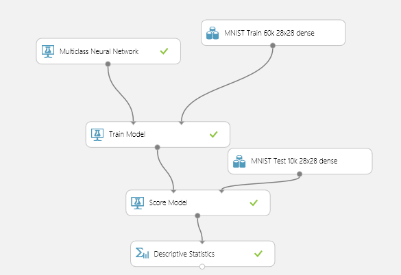
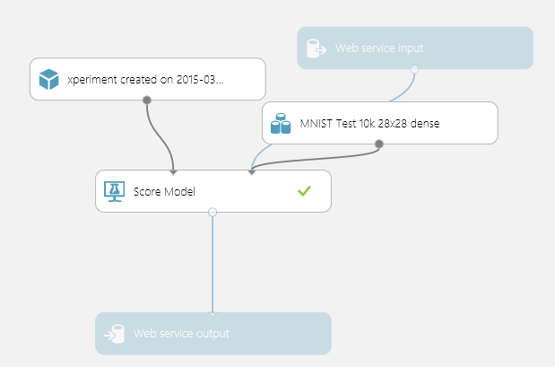

# NeuralAppTest
Neural.NET and Microsoft Azure machine learning service test app for Windows Phone 8.1

Quick test of the Azure machine learning service and Neural.NET's learning algorithm.

Azure network running as a web service trained on the 60k MNIST data set with:
```
eta = .1
hidden neurons = 100
epochs = 100
```

Neural.NET network running locally on the phone trained on the 10k MNIST data set with:
```
eta = .3
hidden neurons = 30
epochs = 30
```

### Training Network



### Scoring Network

